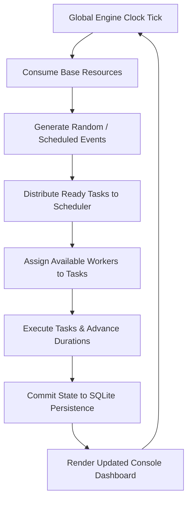

# 01_PRD (Product Requirement Document) - ColonyOS

## 1. Vision & Core Philosophy
**ColonyOS** is a terminal-based colony management simulation game where the player acts as the **colony's operating system** rather than a traditional omnipotent manager. Instead of clicking and dragging colonists, the player manages hardware resource allocations, process priorities, task queue scheduling, database state updates, and incident handling routines.

The core gameplay philosophy is: **"Manage the systems that keep the colony alive, and the workers will follow."**

---

## 2. Product Goals
* **Educational Systems Design**: Teach players real-world computer science and systems engineering principles—such as queueing theory, concurrency safety, relational database storage, scheduling starvation, event busses, and priority inversion—through an engaging sci-fi game loop.
* **Complex Simulation Loop**: Build a deep simulation economy featuring survival-critical resources (Oxygen, Water, Power, Food), structure maintenance, research progression, and dynamic crises.
* **Premium Terminal Aesthetic**: Create a high-fidelity retro CLI that feels responsive, features rich colorized output dashboards, live-updating progress logs, and autocomplete syntax.

---

## 3. Scope & Target Audience

### Target Audience
* **Software Developers & CS Students**: Interested in seeing scheduling algorithms (FIFO, SJF, Round Robin, Priority) and OS resource-sharing concepts applied in a game simulation.
* **Simulation Game Enthusiasts**: Fans of games like *Oxygen Not Included*, *RimWorld*, or *Duskers* who enjoy command-line interfaces, logistics planning, and automation.
* **Open Source Contributors**: Python developers looking for a highly modular, clean, test-covered OOP codebase to extend.

### Out of Scope for v1.0
* Real-time 2D/3D graphical interfaces (the game is strictly text-based CLI/TUI).
* Multi-colony networking or multiplayer trade systems (single-colony local simulation only).
* Direct manual control of workers (workers can only be directed by creating tasks and configuring scheduler algorithms).

---

## 4. Core Gameplay Loop & Mechanics

The core loop behaves as a synchronized engine driven by a global simulation clock (**Ticks**):

1. **Scheduling**: The player submits tasks (e.g., `build solar_array`, `extract water`, `repair life_support`). Tasks go into the **Task Queue**. The player changes active scheduling policies to optimize queue clearance rates.
2. **Worker Management**: Workers are the execution threads. They have health, energy, and skill levels. If a worker runs out of energy, they transition to `Fatigued` and must rest, temporarily blocking the queue.
3. **Resource Balances**: Colony buildings consume resources (e.g., Water and Power) every tick and produce others (e.g., Oxygen, Food). If Power or Oxygen hits 0, colony health degrades.
4. **Random Crises**: Solar flares, micrometeorites, and equipment failures damage buildings, generate emergency repair tasks, and alter queue priorities dynamically.

---

## 5. User Stories

### Persona: Developer Dan (Educational Explorer)
* *As a developer studying systems design, I want to swap the scheduling algorithm from FIFO to Shortest Job First (SJF) so that I can observe how short tasks bypass long construction queues and prevent system latency.*
* *As an explorer, I want to view detailed performance metrics of my queue (wait time, worker idle time, task completion rate) so that I can audit my scheduling efficiency.*

### Persona: gamer Grace (Hardcore Simulation Fan)
* *As a gamer, I want random disasters to break vital machinery, forcing me to manage high-priority emergency repair tasks before my life-support systems deplete oxygen reserves.*
* *As a gamer, I want to research new automations and colony upgrades using refined materials, unlocking higher tier command capabilities.*

---

## 6. Functional Requirements

### 6.1 CLI Shell & Command Parser
* **REQ-1.1**: The system must expose a custom interactive CLI shell with a command prompt matching: `[colony@kepler-442b]$`.
* **REQ-1.2**: Commands must accept flags and arguments (e.g., `queue --set-algo sjf`, `workers --assign 4 --task 12`).
* **REQ-1.3**: Auto-completion, history buffering, and standard help commands must be supported.

### 6.2 Simulation Clock (Tick Engine)
* **REQ-2.1**: The simulation must progress in units called **Ticks**.
* **REQ-2.2**: The tick engine must support two modes:
  * *Manual Ticking*: Simulation steps forward only when the player types `tick` or `wait <ticks>`.
  * *Real-Time Daemon*: A background loop ticks automatically every $N$ seconds (default 1.0s) and refreshes the console display.

### 6.3 Task Queue & Scheduler
* **REQ-3.1**: The queue must manage tasks across distinct lifecycle states: `PENDING`, `READY`, `RUNNING`, `COMPLETED`, `FAILED`, and `RETRY`.
* **REQ-3.2**: The scheduler must support five core algorithms:
  * **FIFO** (First-In, First-Out)
  * **Priority** (Highest user-assigned priority first)
  * **Shortest Job First** (SJF, shortest duration first)
  * **Deadline** (Earliest remaining deadline first)
  * **Round Robin** (Time-sliced execution switching)
* **REQ-3.3**: The player must be able to change algorithms on the fly during active execution.

### 6.4 Worker Lifecycle Engine
* **REQ-4.1**: Workers must be modeled as entities with attributes: Health, Energy, Experience, Skill Level, and Current State (`IDLE`, `WORKING`, `RESTING`, `DEAD`).
* **REQ-4.2**: Workers must automatically consume Energy while working and consume Food/Water from stockpiles every tick.
* **REQ-4.3**: FATIGUED workers (Energy = 0) must enter a mandatory `RESTING` cycle and cannot accept tasks until energy reaches 100%.

### 6.5 Save & Persistence System
* **REQ-5.1**: Game state must be serialized to an SQLite database file.
* **REQ-5.2**: The player must be able to execute `save <name>` and `load <name>` commands.
* **REQ-5.3**: Autosave must trigger every 50 ticks, backing up the active simulation state safely.

---

## 7. Non-Functional Requirements

* **Performance**: The CLI input loop must handle user commands within $<50\text{ ms}$ processing time. Game ticks under stress loads (1,000 tasks, 50 workers) must execute in under $10\text{ ms}$.
* **Concurrency & Safety**: Thread-safe operations must be used when sharing resources between the CLI input thread and the background simulation tick worker threads.
* **State Reliability**: Write-ahead logging (WAL) mode must be enabled on SQLite to prevent save-state corruption during unexpected process exits.
* **Clean Code Standards**: The codebase must enforce strict type hints, format matching Ruff/Black standards, and achieve at least 90% unit test coverage.

---

## 8. Success Metrics

| Metric | Target | Measurement Method |
| :--- | :--- | :--- |
| **Code Coverage** | $\ge 90\%$ | `pytest --cov` test suite analysis. |
| **Scheduler Latency**| $< 2\text{ ms}$ | Average duration of a scheduling assignment loop. |
| **Input Response** | $< 100\text{ ms}$ | Time between command carriage-return and TUI update. |
| **Stability** | $0$ database locks | Validated through thread-concurrency stress test runs. |
| **Game Loop Uptime** | $100\%$ task completion | Simulation test verification of long-running execution. |

---

## 9. Release Milestones

* **Milestone 1 (v0.1 - Core OS Kernel)**: Basic game clock loop, task queue structure, FIFO scheduling, basic resources (Power, Water) tracking, and minimal CLI parser.
* **Milestone 2 (v0.2 - Worker Thread Pool & Database)**: SQLite schema generation, worker thread pools pulling tasks from the database queue, and basic save/load commands.
* **Milestone 3 (v0.3 - Game Economy & Buildings)**: Food/Oxygen resources, building construction/destruction, power grid grids, and production rates calculations.
* **Milestone 4 (v0.4 - Event Bus & Disasters)**: Decoupled pub/sub event bus, hazard injection, weather events, repair pipelines, and automated alarm systems.
* **Milestone 5 (v0.5 - Advanced Scheduling & Research)**: Integration of SJF, Round Robin, Deadline schedulers, and a tech unlock system.
* **Milestone 6 (v1.0 - Polish & Release)**: TUI layout optimization using the `rich` dashboard, stress test execution, and final game balancing.
