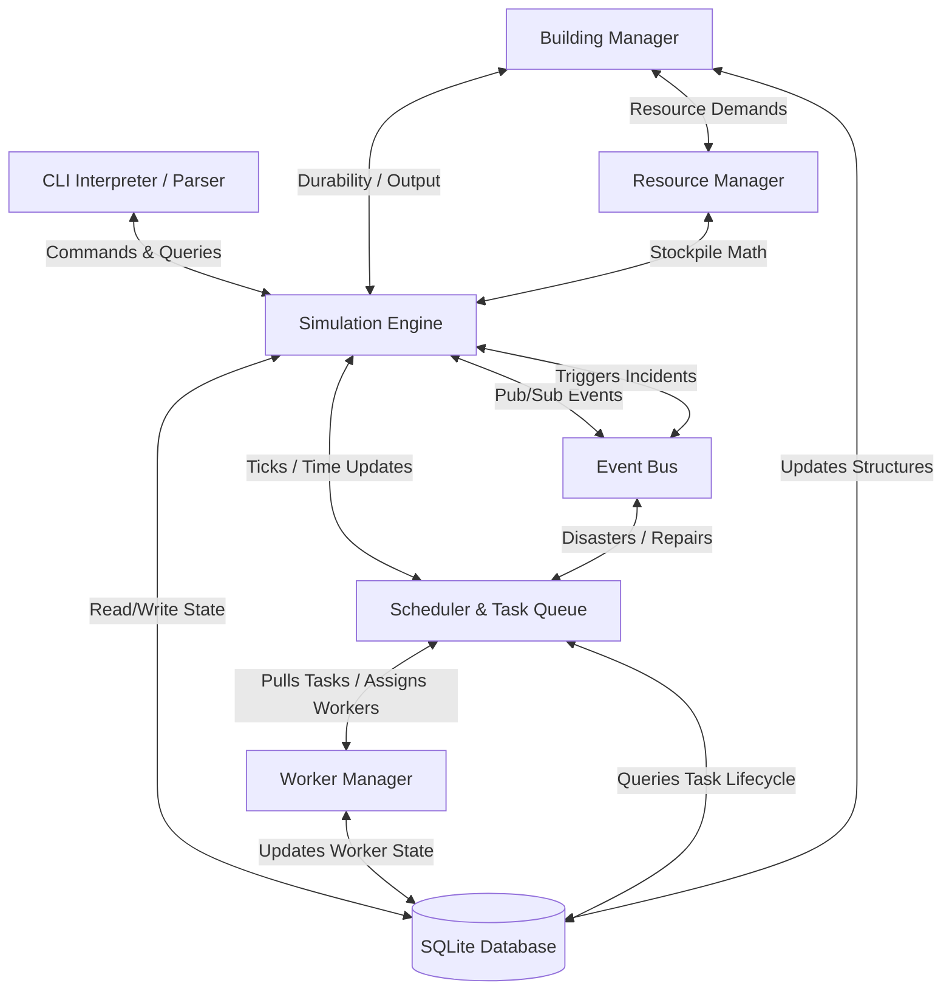
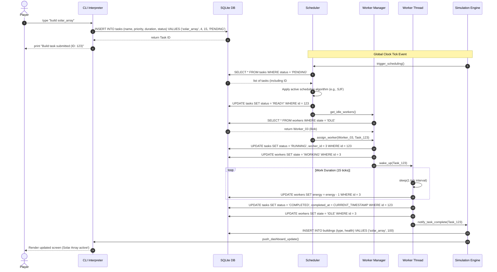
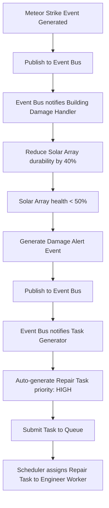

# 02_HLD (High Level Design) - ColonyOS

## 1. System Architecture Overview

ColonyOS uses a modular, decoupled architecture inspired by operating system design. The system runs an event-driven loop and a task queue scheduler, powered by a relational persistence engine.

Here is the high-level architecture diagram showing the components and their boundaries:

---

## 2. Component Responsibilities

| Component | Responsibility | Interface Library |
| :--- | :--- | :--- |
| **CLI Interpreter** | Parses Unix-style commands, validates arguments, formats outputs using tables, progress bars, and colored logs. | `typer`, `rich`, `prompt_toolkit` |
| **Simulation Engine**| Coordinates the global game clock, triggers the periodic tick cycle, updates resource calculations, and invokes save states. | Python built-ins |
| **Scheduler & Queue** | Manages the task priority queue, evaluates scheduling policies (FIFO, SJF, Priority, Round Robin), and schedules tasks. | `queue.PriorityQueue`, `heapq` |
| **Worker Manager** | Tracks the worker pool state, spawns and coordinates worker threads, handles fatigue/resting timers, and manages skills. | `threading.Thread` |
| **Building Manager** | Manages building inventory, calculates power consumption/production output, and monitors structural durability. | Python OOP |
| **Resource Manager** | Tracks commodity stockpiles (Water, Oxygen, Food, Power) and calculates net accumulation rates per tick. | Python OOP |
| **Event Bus** | A decoupled pub/sub message broker routing incidents, hazards, weather conditions, and structural repairs. | Pub/Sub Pattern |
| **Database Adapter** | Marshals memory objects into SQLite tables and handles atomic queries to prevent file locks. | `sqlite3` (or `SQLAlchemy` ORM) |

---

## 3. Communication & Threading Model

To ensure a highly responsive CLI during game ticks, ColonyOS separates execution into two primary execution spaces:

1. **CLI Process Thread (User Input)**:
   * Runs the interactive prompt loop.
   * Parses user requests.
   * Reads state directly from the SQLite database or cached memory models for instantaneous rendering.
   * Enqueues tasks by writing them into the Database Queue.

2. **Simulation Clock & Worker Daemon Threads (Simulation Core)**:
   * A central **Simulation Clock Thread** ticks once every $1.0\text{ seconds}$ (in real-time mode) or on-demand (in manual mode).
   * **Worker Threads** run in a thread pool. When the Scheduler assigns a task to a worker, a worker thread wakes up, consumes simulated ticks to complete the task, decreases worker energy, and updates the task status in the database.
   * All shared states are synchronized using thread-safe data structures and SQL transaction boundaries to prevent race conditions.

---

## 4. Main System Flows

### 4.1 Task Submission & Execution Sequence

The following diagram traces a player executing a build command through the CLI parser, the database task queue, the scheduler, worker assignment, thread execution, and UI rendering:

### 4.2 Disaster Incident & Cascade Sequence

The flow of an environmental hazard through the Event Bus to task creation:

