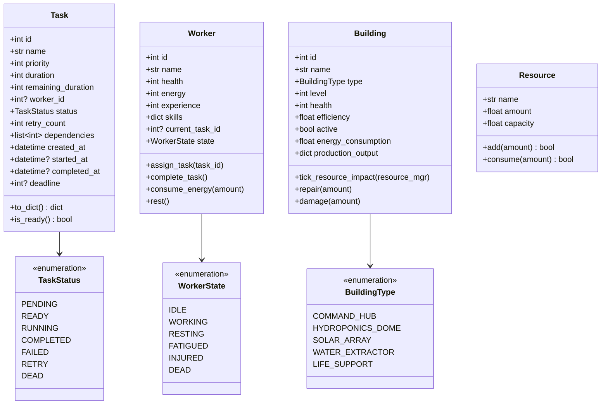

# 03_LLD (Low Level Design) - ColonyOS

## 1. Class Diagrams

The diagram below details the UML class relations, attributes, and methods of the core ColonyOS components:



---

## 2. Core Models Specification

### 2.1 Task Model
The task model represents processes scheduled or executing within the operating system.

* **Attributes**:
  * `id` (`int`): Unique primary key auto-generated by the database.
  * `name` (`str`): Name of the task (e.g., `"Repair Water Extractor"`).
  * `priority` (`int`): Priority score (range 1-5, where 1 is highest priority).
  * `duration` (`int`): Initial duration in simulation ticks required to complete the task.
  * `remaining_duration` (`int`): Remaining ticks required. Decrements each active work tick.
  * `worker_id` (`int?`): Reference to the worker thread assigned. Null if unassigned.
  * `status` (`TaskStatus`): Current lifecycle state.
  * `retry_count` (`int`): Number of times the task has failed and been re-enqueued.
  * `dependencies` (`list[int]`): List of Task IDs that must reach `COMPLETED` before this task becomes `READY`.
  * `deadline` (`int?`): Simulation tick by which this task must complete to avoid failure penalty.

### 2.2 Worker Model
Workers are active agents modeled as thread-bound execution contexts.

* **Attributes**:
  * `id` (`int`): Unique identifier.
  * `name` (`str`): Worker name (e.g., `"Alice"`, `"Bob"`).
  * `health` (`int`): Range 0-100. Degrades during accidents or exposure. If 0, state becomes `DEAD`.
  * `energy` (`int`): Range 0-100. Decrements by 1-5 points per work tick.
  * `experience` (`int`): Increments upon completing tasks. Used for leveling skills.
  * `skills` (`dict[str, int]`): Skill levels (e.g., `{"construction": 3, "agriculture": 1, "engineering": 2}`). Higher skills reduce task durations.
  * `current_task_id` (`int?`): The Task ID currently assigned to the worker.
  * `state` (`WorkerState`): Active operational state.

### 2.3 Building Model
Buildings are static resource-consuming or producing entities.

* **Attributes**:
  * `id` (`int`): Unique identifier.
  * `name` (`str`): Dynamic descriptor (e.g., `"Hydroponics Dome B"`).
  * `type` (`BuildingType`): Infrastructure type determining resource inputs/outputs.
  * `level` (`int`): Structure tier (1 to 5). Upgrading levels increases efficiency/output.
  * `health` (`int`): Durability range 0-100. If 0, the building is destroyed and production stops.
  * `efficiency` (`float`): Multiplier (0.0 to 1.0) scaling output based on building durability and resource inputs.
  * `active` (`bool`): Toggle state. Deactivating buildings stops power draw and production.

---

## 3. Interfaces & APIs

### 3.1 Scheduler Interface
All scheduler implementations (FIFO, SJF, Priority, etc.) must subclass `BaseScheduler`:

```python
class BaseScheduler(ABC):
    @abstractmethod
    def add_task(self, task: Task) -> None:
        """Enqueue task into memory/database priority structures."""
        pass

    @abstractmethod
    def next_task(self) -> Optional[Task]:
        """Retrieve the next ready task according to scheduling policy."""
        pass

    @abstractmethod
    def reorder_queue(self) -> None:
        """Re-sort active queues. Triggered when scheduling algorithms swap."""
        pass
```

### 3.2 Event Bus Interface
Decouples messaging between the simulator, disasters, and tasks:

```python
class EventBusInterface(ABC):
    @abstractmethod
    def subscribe(self, event_type: str, handler: Callable[[Event], None]) -> None:
        """Register a callback handler for a specific event type."""
        pass

    @abstractmethod
    def publish(self, event: Event) -> None:
        """Broadcast event message to all registered subscriber callbacks."""
        pass
```

---

## 4. Concurrency & Threading Design

To prevent race conditions during state modifications (e.g. workers deducting energy, modifying database task entries, updating resource counts), ColonyOS implements the following rules:

1. **Thread-Safe Queueing**:
   * The scheduler uses a thread-safe `queue.PriorityQueue` or utilizes explicit threading locks (`threading.Lock`) around database query transactions.
2. **Atomic SQLite Queries**:
   * Since SQLite is single-write, all database modifications are wrapped in context-managed transactions:
     ```python
     with db.transaction():
         db.update_worker_state(worker.id, WorkerState.WORKING)
     ```
3. **Task Completion Hook**:
   * When a worker thread finishes execution, it does not modify building files directly. Instead, it publishes a `TaskCompleteEvent` to the `EventBus` which is caught by the `SimulationEngine` on the main loop. This ensures that game state transitions happen sequentially inside the main clock cycle.
