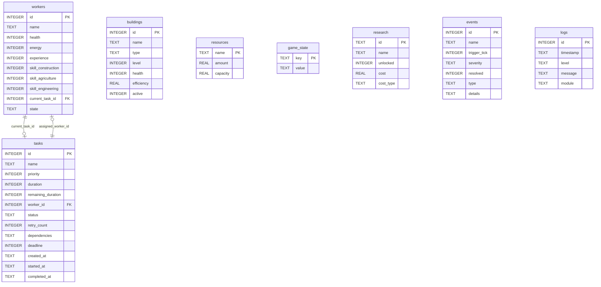

# 04_DATABASE (Database Design) - ColonyOS

## 1. Entity-Relationship (ER) Diagram

ColonyOS utilizes an SQLite relational database schema to store and synchronize active simulation states. 

Below is the Entity-Relationship Diagram (ERD) detailing the relationships between the database tables:



---

## 2. Table DDL Schemas

Below are the SQL DDL statements for creating the ColonyOS tables:

### 2.1 workers
```sql
CREATE TABLE workers (
    id INTEGER PRIMARY KEY AUTOINCREMENT,
    name TEXT NOT NULL,
    health INTEGER DEFAULT 100 CHECK (health BETWEEN 0 AND 100),
    energy INTEGER DEFAULT 100 CHECK (energy BETWEEN 0 AND 100),
    experience INTEGER DEFAULT 0,
    skill_construction INTEGER DEFAULT 1,
    skill_agriculture INTEGER DEFAULT 1,
    skill_engineering INTEGER DEFAULT 1,
    current_task_id INTEGER REFERENCES tasks(id) ON DELETE SET NULL,
    state TEXT DEFAULT 'IDLE' CHECK (state IN ('IDLE', 'WORKING', 'RESTING', 'FATIGUED', 'INJURED', 'DEAD'))
);
```

### 2.2 tasks
```sql
CREATE TABLE tasks (
    id INTEGER PRIMARY KEY AUTOINCREMENT,
    name TEXT NOT NULL,
    priority INTEGER DEFAULT 3 CHECK (priority BETWEEN 1 AND 5),
    duration INTEGER NOT NULL,
    remaining_duration INTEGER NOT NULL,
    worker_id INTEGER REFERENCES workers(id) ON DELETE SET NULL,
    status TEXT DEFAULT 'PENDING' CHECK (status IN ('PENDING', 'READY', 'RUNNING', 'COMPLETED', 'FAILED', 'RETRY', 'DEAD')),
    retry_count INTEGER DEFAULT 0,
    dependencies TEXT, -- Comma-separated list of Task IDs (e.g. "12,14")
    deadline INTEGER,  -- Simulated tick count
    created_at TEXT DEFAULT CURRENT_TIMESTAMP,
    started_at TEXT,
    completed_at TEXT
);
```

### 2.3 buildings
```sql
CREATE TABLE buildings (
    id INTEGER PRIMARY KEY AUTOINCREMENT,
    name TEXT NOT NULL,
    type TEXT NOT NULL CHECK (type IN ('COMMAND_HUB', 'HYDROPONICS_DOME', 'SOLAR_ARRAY', 'WATER_EXTRACTOR', 'LIFE_SUPPORT')),
    level INTEGER DEFAULT 1,
    health INTEGER DEFAULT 100 CHECK (health BETWEEN 0 AND 100),
    efficiency REAL DEFAULT 1.0,
    active INTEGER DEFAULT 1 -- Boolean: 0 = Inactive, 1 = Active
);
```

### 2.4 resources
```sql
CREATE TABLE resources (
    name TEXT PRIMARY KEY CHECK (name IN ('Water', 'Food', 'Oxygen', 'Power', 'IronOre', 'SolarCells')),
    amount REAL DEFAULT 0.0,
    capacity REAL DEFAULT 100.0
);
```

### 2.5 game_state
```sql
CREATE TABLE game_state (
    key TEXT PRIMARY KEY,
    value TEXT NOT NULL
);
```

### 2.6 research
```sql
CREATE TABLE research (
    id TEXT PRIMARY KEY,
    name TEXT NOT NULL,
    unlocked INTEGER DEFAULT 0, -- Boolean: 0 = locked, 1 = unlocked
    cost REAL NOT NULL,
    cost_type TEXT NOT NULL
);
```

---

## 3. Database Optimizations & Indices

To ensure highly responsive reads and writes under real-time simulation tick rates, index keys are added to optimize core scheduler and query operations:

1. **Scheduling Queue Index**:
   * Optimizes the scheduler querying tasks ready for execution.
   ```sql
   CREATE INDEX idx_tasks_status_priority ON tasks (status, priority);
   ```
2. **Worker Lookup Index**:
   * Speeds up matching idle workers to ready jobs.
   ```sql
   CREATE INDEX idx_workers_state ON workers (state);
   ```
3. **Log History Index**:
   * Speeds up CLI rendering of log feeds.
   ```sql
   CREATE INDEX idx_logs_timestamp ON logs (timestamp DESC);
   ```

---

## 4. SQLite Transaction Details

* **WAL Mode**: Write-Ahead Logging (WAL) will be explicitly enabled at database initialization:
  ```sql
  PRAGMA journal_mode=WAL;
  ```
  WAL mode allows multiple concurrent readers to query states (e.g. CLI drawing the dashboard) while a writer transaction (e.g. worker completing a task) updates tables without blocking database files.
* **Concurrency Locking Guard**: Since Python worker threads operate asynchronously, any write access utilizes a thread-safe database connection pool or wrapper that locks the write context during updates.
