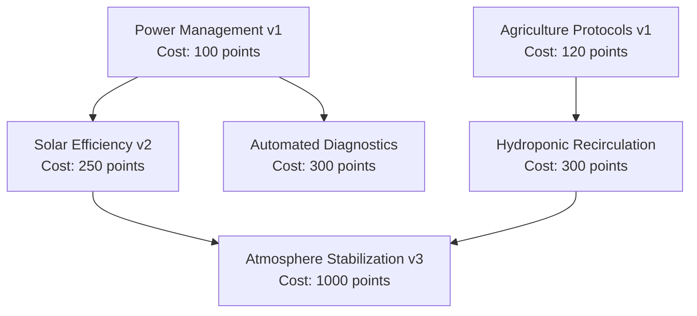

# 05_GAME_DESIGN - ColonyOS

## 1. The Game Loop & Tick Mechanics

ColonyOS operates on a discrete chronological loop governed by a system **Tick**. Each tick represents approximately **1 simulated hour** on Planet Kepler-442b.

```text
Simulation Tick Loop Order of Evaluation:
[01] Apply Solar/Wind power generation
[02] Deduct building operational power consumption
[03] Check for Power Grid Brownout (if consumption > production)
[04] Deduct Worker life-support consumption (Food, Water, Oxygen)
[05] Deduct Building environmental degradation (durability decay)
[06] Process Research point accumulations
[07] Run Event Bus disaster triggers
[08] Tick Worker current task execution durations
[09] Check Victory & Failure Conditions
[10] Commit state to DB and render update
```

---

## 2. Resource & Economic Formulas

### 2.1 Worker Base Consumption
Every active, living worker consumes resources from stockpiles *every tick* according to state:

$$\text{Resource Consumption}_{\text{worker}} = \begin{cases} 
\text{Food: } 1.0\text{ kg}, \text{ Water: } 2.0\text{ L}, \text{ Oxygen: } 3.0\text{ m}^3 & (\text{Working}) \\
\text{Food: } 0.5\text{ kg}, \text{ Water: } 1.0\text{ L}, \text{ Oxygen: } 3.0\text{ m}^3 & (\text{Idle/Resting})
\end{cases}$$

If Food or Water reserves reach $0$, workers stop recovering energy, and their health decays by **5 points per tick**. 
If Oxygen reserves reach $0$, workers begin asphyxiating and health decays by **20 points per tick**.

### 2.2 Power Grid Math & Brownouts
Power is a transient resource calculated fresh each tick:

$$\text{Power Net} = \sum \text{Production}_{\text{buildings}} - \sum \text{Consumption}_{\text{buildings}}$$

* **Nominal Grid ($\text{Power Net} \ge 0$)**: All buildings function at $100\%$ efficiency. Excess power is lost unless battery arrays (Power Capacity structures) are built.
* **Brownout ($\text{Power Net} < 0$)**: Grid goes into failure. The Building Manager deactivates buildings starting from low priority (e.g., Hydroponics Dome, Water Extractor) to match power production, leaving critical Life Support active. Deactivated buildings cease production.

---

## 3. Buildings Catalog

Buildings deteriorate by **1% durability per tick** due to the harsh environmental conditions on Kepler-442b. If durability drops below $50\%$, building production efficiency scales linearly with durability. At $0\%$ health, the building becomes disabled.

| Building | Construction Cost | Power Impact | Production Rate | Max Durability |
| :--- | :--- | :--- | :--- | :--- |
| **Command Hub** | Starter (Cannot build more) | $-10\text{ kW}$ | None | 200 |
| **Solar Array** | $50\text{ kg Iron}, 2\text{ Solar Cells}$| $+40\text{ kW}$ (daytime) | None | 100 |
| **Hydroponics Dome**| $80\text{ kg Iron}, 10\text{ L Water}$ | $-20\text{ kW}$ | $+4.0\text{ kg Food/tick}$ | 120 |
| **Water Extractor** | $60\text{ kg Iron}$ | $-15\text{ kW}$ | $+8.0\text{ L Water/tick}$ | 100 |
| **Life Support Unit**| $120\text{ kg Iron}, 4\text{ Solar Cells}$| $-30\text{ kW}$ | $+10.0\text{ m}^3\text{ Oxygen/tick}$ | 150 |

---

## 4. Research Progression Tree

Research allows the colony operating system to unlock advanced automation protocols, improve worker efficiency, or reduce building power draw. The player initiates research via `research --start <tech_id>`.



* **Power Management v1**: Reduces building standby power draw by $15\%$.
* **Solar Efficiency v2**: Increases Solar Array output by $+15\text{ kW}$.
* **Automated Diagnostics**: Speeds up repair tasks by $20\%$ (workers complete repair tasks in fewer ticks).
* **Agriculture Protocols v1**: Increases Hydroponics Dome food output by $25\%$.
* **Hydroponic Recirculation**: Reduces water requirement of Hydroponics Domes by $50\%$.
* **Atmosphere Stabilization v3**: Unlocks the Atmosphere Stabilizer construct (Required for Victory).

---

## 5. Game Conditions

### 5.1 Failure Conditions
The OS kernel shuts down (Game Over) if any of the following occur:
1. **Critical Depopulation**: All colony workers reach $0$ health and are marked `DEAD`.
2. **Command Hub Breach**: The Central Command Hub's durability reaches $0\%$ due to neglect or damage from disaster events.
3. **Atmospheric Collapse**: Oxygen levels remain at $0$ for $15$ consecutive ticks.

### 5.2 Victory Conditions
To successfully complete the simulation:
1. Research **Atmosphere Stabilization v3**.
2. Construct the **Atmosphere Stabilizer** ($500\text{ kg Iron}$, $50\text{ Solar Cells}$, requires Level 3 Command Hub).
3. Activate the Stabilizer and maintain $95\%$ structural integrity across all colony buildings for $50$ continuous ticks while processing atmospheric scrub cycles.
