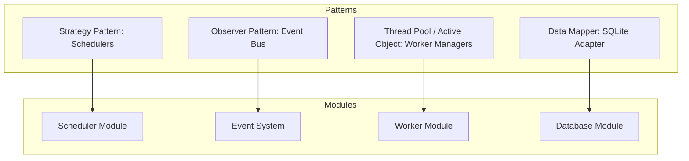

# 06_ARCHITECTURE (Architecture Document) - ColonyOS

## 1. Architectural Principles

ColonyOS is designed to behave like a mini operating system kernel regulating a simulation environment. The architecture is built on three core design tenets:
1. **Decoupling**: The user interface (CLI), the simulation loop (physics), the resource manager, and the worker threads operate independently. They exchange information strictly through transactional SQLite updates or the central Event Bus.
2. **Deterministic Engine**: Given a seed, a task queue order, and a set of inputs, the simulation state advances deterministically tick-by-tick.
3. **Robust Persistence**: Every tick state is fully queryable in relational tables, allowing instant crashes or shutdowns to recover without state loss.

---

## 2. Component Design & Patterns

The table below describes the patterns applied to key modules:



### 2.1 Strategy Pattern (Scheduler Policies)
* **Rationale**: The scheduling algorithm can be dynamically changed during runtime by the player typing `queue --set-algo <algo>`.
* **Implementation**: The `Scheduler` class delegates the task selection to an interface (`BaseScheduler`). Concrete implementations like `FIFOScheduler`, `PriorityScheduler`, `SJFScheduler`, and `RoundRobinScheduler` process the tasks collection according to their specific algorithm rules.

### 2.2 Observer Pattern / Pub/Sub (Event Bus)
* **Rationale**: Disasters, alerts, and system state updates should not be tightly coupled. For instance, a solar flare incident should not have hardcoded references to the power grid, worker energy, or UI loggers.
* **Implementation**: A central `EventBus` singleton maintains a mapping of Event Type keys to collections of callable handler callbacks. Any module can publish an event (e.g., `MeteorStrikeEvent`). The bus routes the payload to registered subscribers (`BuildingDamageHandler`, `UINotificationLogger`) asynchronously or synchronously.

### 2.3 Active Object / Thread Pool (Worker Concurrency)
* **Rationale**: Colony workers simulate independent, asynchronous agents that act concurrently.
* **Implementation**: The `WorkerManager` initiates worker threads (`WorkerThread`). Each thread runs a loop that waits on the database or memory signal for an assigned task. Once assigned, the thread works for $N$ ticks, locking resource stockpiles during transactions, then sleeps between ticks to simulate time passing.

---

## 3. Extensibility & Plugin Architecture

To encourage open-source modification and scalability, ColonyOS loads buildings, disasters, and technologies from external YAML/JSON configuration blueprints.

```text
/config/
├── buildings.yaml   # Defines building types, costs, power draw, durability
├── research.yaml    # Defines technology trees, costs, and unlock modifiers
└── events.yaml      # Defines disaster weights, triggers, and impact actions
```

### Adding a Custom Building:
A modder or developer can define a new building type in `buildings.yaml` without changing the source code:
```yaml
refinery:
  name: "Silicon Refiner"
  construction_cost:
    IronOre: 120
  power_consumption: 25
  production:
    SolarCells: 1.5
  durability: 100
```
The `BuildingManager` parses this config file at startup, registers the `refinery` type, and automatically exposes it to the player via the CLI command `build --type refinery`.

---

## 4. Logging & Auditing (OS Syslog)

ColonyOS maintains an in-database system log matching the Linux syslog standard (`/var/log/syslog`).

* **Log Levels**: `DEBUG`, `INFO`, `WARNING`, `ERROR`, `CRITICAL`.
* **Logging Targets**:
  * **File**: `colony_os.log` for debugging and crash analysis.
  * **Database**: `logs` table, allowing the CLI command `logs --filter ERROR` to query the history directly.
  * **TUI Console**: Colored console messages rendered in the dashboard feed.

### Log Entry Schema:
```json
{
  "timestamp": "2026-07-14 18:56:04",
  "module": "SCHEDULER",
  "level": "WARNING",
  "message": "Task ID 42 (Repair) has been waiting in the queue for 12 ticks. Starvation risk detected."
}
```
This logging architecture is highly valuable for auditing scheduling latency and debugging worker race conditions.
