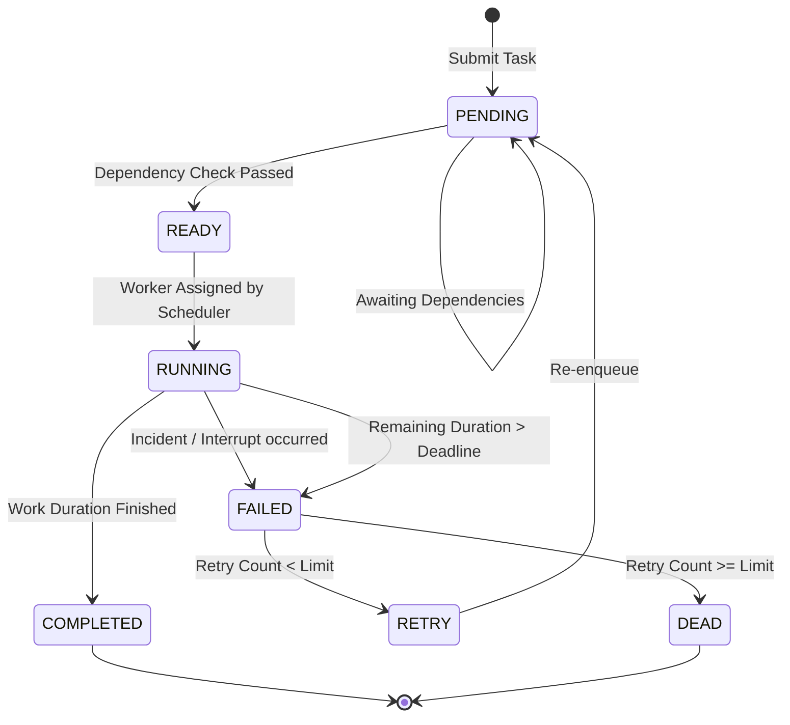

# 07_TASK_QUEUE - ColonyOS

## 1. Task State Machine & Lifecycle

Every process submitted to ColonyOS transitions through a rigid state lifecycle. The following state diagram tracks the execution flow:



### State Transitions & Triggers

| Current State | Next State | Trigger / Condition | Action |
| :--- | :--- | :--- | :--- |
| **None** | `PENDING` | Player submits build/harvest command or Event Bus triggers repair task. | Write task row to DB, set `created_at` timestamp. |
| `PENDING` | `READY` | Clock ticks; Dependency resolver verifies all parent tasks are `COMPLETED`. | State changes to `READY`. Task becomes eligible for scheduling. |
| `READY` | `RUNNING` | Active Scheduler matches the task with an idle worker thread. | Set `started_at` timestamp, set `worker_id`, start worker work thread. |
| `RUNNING` | `COMPLETED` | Worker completes remaining work duration ticks. | Set `completed_at` timestamp, release worker thread, grant experience points. |
| `RUNNING` | `FAILED` | Worker suffers injury, building is destroyed during task, or task deadline expires. | Set `worker_id` to Null. Increment `retry_count`. |
| `FAILED` | `RETRY` | `retry_count` is less than system maximum limit (default: 3). | Reset duration metrics, set state back to `PENDING`. |
| `FAILED` | `DEAD` | `retry_count` reaches or exceeds maximum limit. | Log critical failure; set state to `DEAD`. Archive task. |

---

## 2. Scheduling Algorithms

The scheduling sub-system supports multiple selectable policies to route tasks to workers:

### 2.1 FIFO (First-In, First-Out)
* **Algorithm**: Order by `created_at` timestamp ascending.
* **Characteristics**: Simple, fair, but susceptible to the **convoy effect** (a long construction task blocks short water collection tasks, causing colony dehydration).

### 2.2 User-defined Priority
* **Algorithm**: Order by priority tier ascending ($1 \to 5$), then by `created_at` ascending.
* **Characteristics**: Ensures critical tasks run first, but can cause **starvation** of low-priority tasks (e.g. garbage collection or inventory sorting is never executed if emergencies persist).

### 2.3 SJF (Shortest Job First)
* **Algorithm**: Order by `remaining_duration` ascending.
* **Characteristics**: Provably minimizes average task waiting time, but long construction tasks are starved if short tasks are constantly injected.

### 2.4 Deadline (Earliest Deadline First - EDF)
* **Algorithm**: Order by remaining ticks until deadline (`deadline - current_tick`) ascending.
* **Characteristics**: Optimal for real-time systems. Tasks facing immediate failure penalties bypass standard queues.

### 2.5 Round Robin (Time-Sliced)
* **Algorithm**: Run each task for a maximum of **3 ticks** (time quantum). If incomplete, update remaining duration, release the worker, place the task at the back of the queue, and assign the next task.
* **Characteristics**: Prevents starvation completely. All tasks make steady progress, though context-switching incurs administrative overhead (deducts 0.5 ticks of worker progress).

---

## 3. Queue Thread Safety & Concurrency Control

To implement scheduling algorithms in Python securely across CLI and worker threads, the `Scheduler` wraps access using locks:

```python
class TaskQueue:
    def __init__(self):
        self._lock = threading.Lock()
        self._queue = []

    def push(self, task: Task) -> None:
        with self._lock:
            # Add to thread-safe heap or list
            self._queue.append(task)
            self._sort_queue_by_active_policy()

    def pop_next(self) -> Optional[Task]:
        with self._lock:
            if not self._queue:
                return None
            return self._queue.pop(0)
```

### Priority Aging Strategy (Starvation Prevention)
To prevent priority or SJF starvation, an **Aging Daemon** runs every 10 ticks:
* Any task in the `PENDING` or `READY` state that has waited longer than **20 ticks** has its effective priority boosted:
  $$\text{Effective Priority} = \max(1, \text{Base Priority} - \lfloor\text{Wait Ticks} / 20\rfloor)$$
* Once completed or run, the task priority resets to its baseline.
