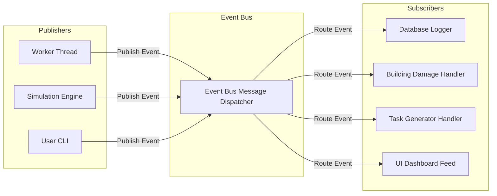
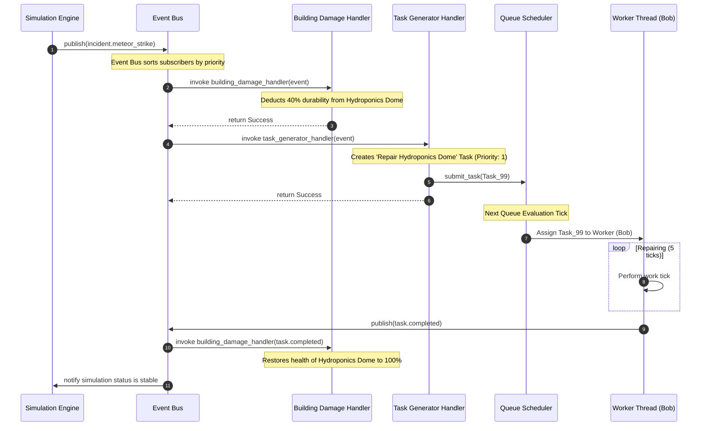

# 08_EVENT_SYSTEM - ColonyOS

## 1. Event Bus Architecture

ColonyOS utilizes a decoupled **Publish/Subscribe (Pub/Sub) Event Bus** pattern to propagate occurrences (disasters, alerts, completed tasks, building brownouts) to their respective handlers. This ensures core game physics and logical systems remain clean and independent.



---

## 2. Event Structure

Every event published to the Event Bus contains a structured payload wrapping details about the trigger:

```python
@dataclass
class Event:
    event_id: str          # Unique UUID
    event_type: str        # E.g., "incident.meteor_strike", "task.completed"
    priority: int          # Propagation order (1: Critical, 5: Low)
    publisher: str         # Module name (e.g., "SIMULATION_ENGINE")
    timestamp: float       # Epoch float
    payload: dict          # Key-value details of the event
```

### Common Event Types & Payloads:

* **`incident.meteor_strike`**:
  * Payload: `{"building_id": 4, "damage_amount": 35, "crater_formed": True}`
* **`task.completed`**:
  * Payload: `{"task_id": 123, "worker_id": 3, "duration_spent": 15}`
* **`resource.depleted`**:
  * Payload: `{"resource_name": "Oxygen", "ticks_at_zero": 1}`

---

## 3. Subscriber Registry & Priority Dispatching

Subscribers register with the Event Bus specifying an Event Type. Multiple subscribers can listen to the same event. To enforce ordered execution (e.g., the *logger* must record the disaster before the *damage handler* modifies values and checks for failure), the Event Bus supports subscription **Priority Tiers**:

```python
class EventBus:
    def __init__(self):
        # Maps event_type -> list of (priority, handler_callback)
        self._subscribers: dict[str, list[tuple[int, Callable]]] = {}

    def subscribe(self, event_type: str, handler: Callable, priority: int = 3) -> None:
        if event_type not in self._subscribers:
            self._subscribers[event_type] = []
        self._subscribers[event_type].append((priority, handler))
        # Sort so highest priority (lowest number) is executed first
        self._subscribers[event_type].sort(key=lambda x: x[0])

    def publish(self, event: Event) -> None:
        if event.event_type not in self._subscribers:
            return
        for priority, handler in self._subscribers[event.event_type]:
            # Execute handler synchronously or dispatch to thread pool
            handler(event)
```

---

## 4. Walkthrough: The Meteor Strike Event Chain

Here is a step-by-step trace of a dynamic game incident starting from a random disaster tick to worker dispatch and building restoration:


