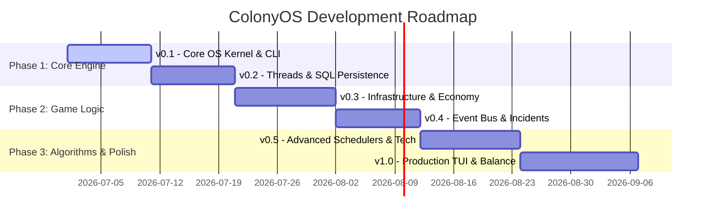

# 11_ROADMAP - ColonyOS

This roadmap outlines the development cycle of ColonyOS from prototype to production-ready simulation.

---

## 🗺️ Milestone Release Plan

---

## 🚀 Version Breakdown

### v0.1 - Core OS Kernel (The Prototype)
* **Goal**: Establish the base command shell and basic resource calculations.
* **Deliverables**:
  * Typer-based terminal shell environment (`[colony@kepler-442b]$`).
  * Manual simulation ticks triggered by `tick` or `wait` commands.
  * In-memory task queue running FIFO scheduling.
  * Stockpile trackers for Power and Water.

### v0.2 - Threads & SQL Persistence (The Infrastructure)
* **Goal**: Enable asynchronous worker execution and relational storage.
* **Deliverables**:
  * SQLite database integration storing task queue tables.
  * Worker thread pool processing concurrent tasks.
  * Save/Load persistence engine (`save --name` and `load --name`).
  * Thread synchronization guards and WAL mode integration.

### v0.3 - Infrastructure & Economy (The Mechanics)
* **Goal**: Build building placement rules, survival limits, and resource generation curves.
* **Deliverables**:
  * Building catalog (Hydroponics, Solar Array, Life Support, Command Hub).
  * Power grid brownout rules and building durability decay rates.
  * Life-support consumption rates per worker (Food, Water, Oxygen).
  * Worker skill experience level modifiers.

### v0.4 - Event Bus & Incidents (The Chaos)
* **Goal**: Add random disasters, alarm logs, and repair pipelines.
* **Deliverables**:
  * Synchronous/Asynchronous Pub/Sub Event Bus.
  * Random environment event loops (Solar flares, meteor strikes).
  * Auto-generation of Emergency Repair Tasks on building damage.
  * System logging database integration (`logs` command).

### v0.5 - Advanced Schedulers & Tech (The Optimization)
* **Goal**: Implement real scheduling algorithms and progression trees.
* **Deliverables**:
  * SJF, Priority, EDF, and Round Robin scheduling algorithms.
  * Priority aging system to mitigate task starvation.
  * Research tree schema and unlocking capabilities in-game.

### v1.0 - Production TUI & Balance (The Launch)
* **Goal**: Premium terminal UX and balanced economy numbers.
* **Deliverables**:
  * Live-updating CLI dashboard utilizing `rich` rendering components.
  * Stress testing validation under 100-hour loads.
  * Comprehensive tuning of event spawn rates and durability math.

---

## 🔮 Future Enhancements (v1.1+)

1. **REST API Interface**:
   * Run a background REST server (FastAPI) alongside the game engine, exposing endpoints to monitor colony resource metrics.
2. **Web Monitoring Dashboard**:
   * Build a React/Vite-based modern dashboard web application that reads the game's SQLite DB or calls the REST API to draw live chart plots of resource levels and queue state.
3. **Modding System**:
   * Allow loading custom Python scripts at startup to inject new custom events or unique buildings directly.
